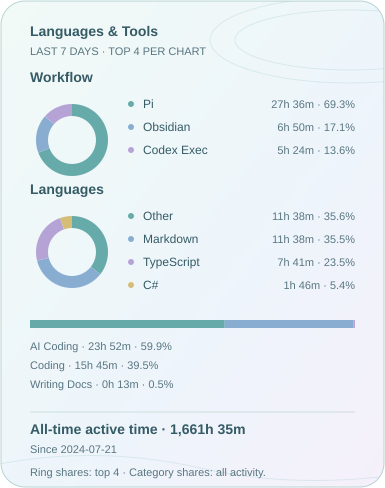

<!-- https://readme-typing-svg.demolab.com/demo/  -->      

**Recent Blog Posts**

<!-- blog starts -->
<table>
<tr><td width="160" valign="top"></td><td valign="top"><a href="https://xnnehang.top/en/posts/repository-split-cherry-pick-debt/">Splitting Repositories Is Not Decoupling: How Copied Shared Code Turns Cross-Repo Cherry-Picks into Maintenance Debt</a> A maintenance retrospective across three Labs and three Launchers, and why copying shared code that still evolves turns cross-repository cherry-picks into long-term debt. 2026-08-27</td></tr>
<tr><td width="160" valign="top"></td><td valign="top"><a href="https://xnnehang.top/en/posts/from-single-frame-to-real-time-video-conversation/">From Single-Frame Vision to Real-Time Video Conversation: The Multimodal Architecture Paths of DeepSeek, MiniCPM, and MiniMax</a> From DeepSeek visual primitives and MiniMax-M3 image TTFT to how MiniCPM-o sustains local video understanding and full-duplex speech interaction. 2026-08-25</td></tr>
<tr><td width="160" valign="top"></td><td valign="top"><a href="https://xnnehang.top/en/posts/category-kind-tags/">Can an Article Belong in Only One Drawer? Rethinking Category, Kind, and Tags</a> When technology, reviews, and reflection keep converging in the same post, I have to reconsider what a blog category is actually supposed to answer. 2026-08-23</td></tr>
</table>
<!-- blog ends -->

Here is my [cat🐾](https://github.com/xnne-bot) powered by openclaw.
